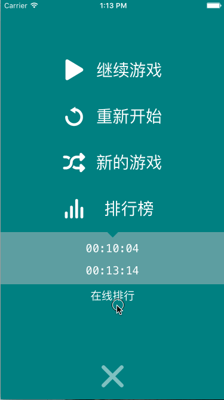

# react-native-sudoku
a simple sudoku game written in React Native, with only one level for masters

I've made a record in **03:43** , I'd like to see if someone can break my record 😃 

I've also developed an app in React Native for developers called [NeoReader](https://github.com/nihgwu/NeoReader), wish you will love it too 😄

## DEMO

## Features
1. Animations
2. Editing Mode
3. Game Resume
4. Online Ranking

## Download
[iOS version](https://itunes.apple.com/cn/app/shu-du-zhong-shi-chun-cui/id1138612488)

[Android version](http://a.app.qq.com/o/simple.jsp?pkgname=com.liteneo.sudoku)

## Resources
1. sudoku generator: https://github.com/dachev/sudoku, just replace `underscore` with `lodash`
2. all the icons are downloaded from http://www.iconfont.cn/ 
3. use [LeanCloud](https://leancloud.cn/) to store the online scores

## Build
1. clone this repo
2. `npm install`
3. `react-native link`
4. config your leancloud accout https://github.com/nihgwu/react-native-leancloud
5. `react-native run-ios` or `react-native run-android`

## Plan
1. different level
2. I18N support
3. store all the scores to cloud server

## Privacy Policy
[see](./PRIVACY.md)

## License
MIT
